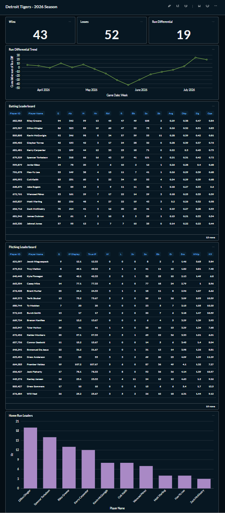

# Tigers Data Platform

An end-to-end **ELT pipeline and analytics platform** for Detroit Tigers baseball — ingesting live MLB data, modeling it into a tested star schema, and surfacing it in dashboards. Built to deepen modern data-engineering skills on a dataset I actually care about.



> Sibling to a weather ELT project; this one applies the same patterns to baseball and adds a visualization layer.

## Architecture

```
MLB Stats API
     |
     v
Python ingestion  -->  raw tables (Postgres)
 (idempotent,               |
  incremental)              v
     |            dbt: staging --> star schema (marts) + SCD2 player snapshot
     |                          |
     v                          v
 Airflow (daily) [planned]  Metabase dashboards [planned]
```

## Tech stack

| Layer | Tool |
|---|---|
| Containerization | Docker, Docker Compose |
| Ingestion | Python (requests, pandas, SQLAlchemy) |
| Storage | PostgreSQL 18 |
| Transformation | dbt (staging -> marts, tests, SCD2 snapshot) |
| Visualization | Metabase |
| Orchestration | Apache Airflow *(planned)* |
| CI/CD | GitHub Actions *(planned)* |

## What's implemented

**Ingestion** — pulls the Tigers' schedule and per-game boxscores from the MLB Stats API into a `raw` schema. Idempotent (delete-insert by game), incremental (watermark by game date), with a retry helper for transient API errors.

**Transformation (dbt)** — staging models clean and type the raw data; a star schema (`fact_batting`, `fact_pitching` + `dim_player`, `dim_team`, `dim_date`, `dim_game`) with `not_null` / `unique` / `relationships` tests; **SCD Type 2** player snapshot tracking team changes (trades) over time.

## Data model

Grain: **one row per player per game.**
- Facts: `fact_batting`, `fact_pitching`
- Dimensions: `dim_player` (SCD2), `dim_team`, `dim_date`, `dim_game`

## Getting started

Prereqs: Docker, Python 3.12.

```
echo "PG_PASSWORD=your_password" > .env
docker compose up -d
python -m venv .venv && source .venv/bin/activate
pip install requests pandas sqlalchemy psycopg2-binary pyarrow
python ingest_tigers.py
cd Tigers_2026 && pip install dbt-postgres && dbt build
```

Postgres runs on host port **5433**; dbt builds into the `analytics` schema. See `PROJECT_STATUS.md` for full details and `docs/dashboard_brief.md` for the visualization spec.

## Roadmap

- [x] Ingestion (idempotent, incremental)
- [x] dbt star schema + SCD2 snapshot + tests
- [x] Metabase dashboards
- [ ] Airflow daily orchestration
- [ ] CI/CD (GitHub Actions)

## Concepts demonstrated

Idempotent + incremental loading, API ingestion with retries, dimensional modeling (star schema), SCD Type 2 history, data-quality tests as code.

---
*Learning project, in active development.*